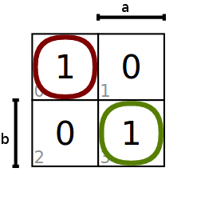
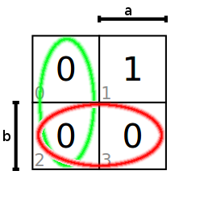
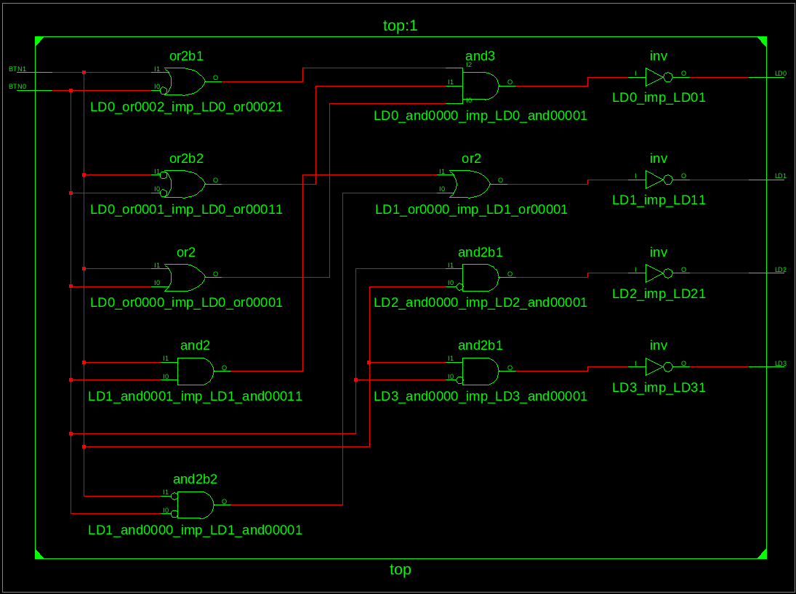

# Lab 2: Introduction to Xilinx ISE

#### Contents

1. [Lab prerequisites](#Lab-prerequisites)
2. [Used hardware components](#Used-hardware-components)
3. [Synchronize Git and create a new folder](#Synchronize-Git-and-create-a-new-folder)
4. [Digital circuits in VHDL language](#Digital-circuits-in-VHDL-language)
5. [Clean project and synchronize git](#Clean-project-and-synchronize-git)
6. [Ideas for other tasks](#Ideas-for-other-tasks)

## Lab prerequisites

1. *Digital* or *Binary comparator*

    | **A** | **B** | **A>B** | **A=B** | **A<B** |
    | :-: | :-: | :-: | :-: | :-: |
    | 0 | 0 | 0 | 1 | 0 |
    | 0 | 1 | 0 | 0 | 1 |
    | 1 | 0 | 1 | 0 | 0 |
    | 1 | 1 | 0 | 1 | 0 |

    According to the truth table, create canonical SoP (Sum of Product) or PoS (Product of Sum) output forms as follows:

    &nbsp;

    

    &nbsp;
    
    
    
    &nbsp;
    
    
    
    &nbsp;

    Create K-maps for all three functions.
    
    
    
    

    &nbsp;

    &nbsp;

    Use the K-map to create the minimum  function.

    &nbsp;

    
    
    &nbsp;

    > Equations and symbols were generated by [Online LaTeX Equation Editor](https://www.codecogs.com/latex/eqneditor.php) as an Encoded URL link.
    [Karnaugh maps Editor](https://www.mathematik.uni-marburg.de/~thormae/lectures/ti1/code/karnaughmap/) as Encoded URL link.
    [VHDL cheatsheet](https://www.csee.umbc.edu/portal/help/VHDL/operator.html)
    >
    &nbsp;&nbsp;&nbsp;&nbsp;
    
    &nbsp;&nbsp;&nbsp;&nbsp;
