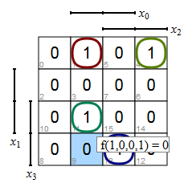
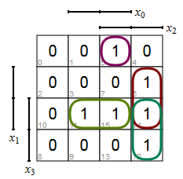
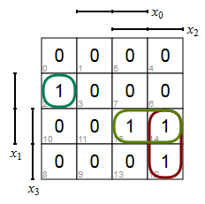
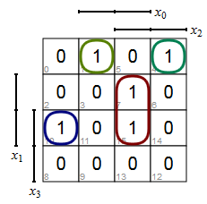
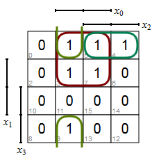
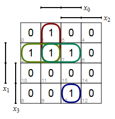
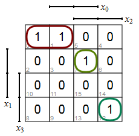

# Lab 3: Hex to seven-segment decoder

#### Contents

1. [Prerequisites](#Prerequisites)
2. [Used hardware components](#Used-hardware-components)
3. [Hex to seven-segment VHDL code](#Hex-to-seven-segment-VHDL-code)
4. [Top level VHDL code](#Top-level-VHDL-code)


## Prerequisites

| **Hex** | **Input** | **a** | **b** | **c** | **d** | **e** | **f** | **g** |
| :-: | :-: | :-: | :-: | :-: | :-: | :-: | :-: | :-: |
| 0 | 0000 | 0 | 0 | 0 | 0 | 0 | 0 | 1 |
| 1 | 0001 | 1 | 0 | 0 | 1 | 1 | 1 | 1 |
| 2 | 0010 | 0 | 0 | 1 | 0 | 0 | 1 | 0 |
| 3 | 0011 | 0 | 0 | 0 | 0 | 1 | 1 | 0 |
| 4 | 0100 | 1 | 0 | 0 | 1 | 1 | 0 | 0 |
| 5 | 0101 | 0 | 1 | 0 | 0 | 1 | 0 | 0 |
| 6 | 0110 | 0 | 1 | 0 | 0 | 0 | 0 | 0 |
| 7 | 0111 | 0 | 0 | 0 | 1 | 1 | 1 | 1 |
| 8 | 1000 | 0 | 0 | 0 | 0 | 0 | 0 | 0 |
| 9 | 1001 | 0 | 0 | 0 | 0 | 1 | 0 | 0 |
| A | 1010 | 0 | 0 | 0 | 1 | 0 | 0 | 0 |
| b | 1011 | 1 | 1 | 0 | 0 | 0 | 0 | 0 |
| C | 1100 | 0 | 1 | 1 | 0 | 0 | 0 | 1 |
| d | 1101 | 1 | 0 | 0 | 0 | 0 | 1 | 0 |
| E | 1110 | 0 | 1 | 1 | 0 | 0 | 0 | 0 |
| F | 1111 | 0 | 1 | 1 | 1 | 0 | 0 | 0 |











## Used hardware components

1. CoolRunner-II CPLD starter board ([XC2C256-TQ144](../../Docs/xc2c256_cpld.pdf)): [Manual](../../Docs/coolrunner-ii_rm.pdf), [Schematic](../../Docs/coolrunner-ii_sch.pdf).


## Hex to seven-segment VHDL code


```vhdl
------------------------------------------------------------------------
--
-- Hex to seven-segment decoder.
-- Xilinx XC2C256-TQ144 CPLD, ISE Design Suite 14.7
--
-- Copyright (c) 2019-2020 Tomas Fryza
-- Dept. of Radio Electronics, Brno University of Technology, Czechia
-- This work is licensed under the terms of the MIT license.
--
------------------------------------------------------------------------

library ieee;
use ieee.std_logic_1164.all;

------------------------------------------------------------------------
-- Entity declaration for hex to seven-segment decoder
------------------------------------------------------------------------
entity hex_to_7seg is
    port (hex_i: in  std_logic_vector(4-1 downto 0);
          seg_o: out std_logic_vector(7-1 downto 0));
end entity hex_to_7seg;

------------------------------------------------------------------------
-- Architecture declaration for hex to seven-segment decoder
------------------------------------------------------------------------
architecture Behavioral of hex_to_7seg is
begin

    --------------------------------------------------------------------
    --         a
    --       -----          a: seg_o(6)
    --    f |     | b       b: seg_o(5)
    --      |  g  |         c: seg_o(4)
    --       -----          d: seg_o(3)
    --    e |     | c       e: seg_o(2)
    --      |     |         f: seg_o(1)
    --       -----          g: seg_o(0)
    --         d
    --------------------------------------------------------------------
    seg_o <= "0000001" when (hex_i = "0000") else   -- 0
             "1001111" when (hex_i = "0001") else   -- 1

             -- WRITE YOUR CODE HERE
             "0010010" when (hex_i = "0010") else   -- 2
             "0000110" when (hex_i = "0011") else   -- 3
             "1001100" when (hex_i = "0100") else   -- 4
             "0100100" when (hex_i = "0101") else   -- 5
             "0100000" when (hex_i = "0110") else   -- 6
             "0001111" when (hex_i = "0111") else   -- 7
             "0000000" when (hex_i = "1000") else   -- 8
             "0000100" when (hex_i = "1001") else   -- 9
             "0001000" when (hex_i = "1010") else   -- A
             "1100000" when (hex_i = "1011") else   -- b
             "0110001" when (hex_i = "1100") else   -- C
             "1000010" when (hex_i = "1101") else   -- d

             "0110000" when (hex_i = "1110") else   -- E
             "0111000";                             -- F

end architecture Behavioral;
```

## Top level VHDL code


```vhdl
------------------------------------------------------------------------
--
-- Implementation of hex to seven-segment decoder.
-- Xilinx XC2C256-TQ144 CPLD, ISE Design Suite 14.7
--
-- Copyright (c) 2018-2020 Tomas Fryza
-- Dept. of Radio Electronics, Brno University of Technology, Czechia
-- This work is licensed under the terms of the MIT license.
--
------------------------------------------------------------------------

library ieee;
use ieee.std_logic_1164.all;

------------------------------------------------------------------------
-- Entity declaration for top level
------------------------------------------------------------------------
entity top is
    port (SW0, SW1:           in  std_logic;
          BTN0, BTN1:         in  std_logic;
          LD0, LD1, LD2, LD3: out std_logic;
          disp_seg_o:         out std_logic_vector(7-1 downto 0);
          disp_dig_o:         out std_logic_vector(4-1 downto 0));
end entity top;

------------------------------------------------------------------------
-- Architecture declaration for top level
------------------------------------------------------------------------
architecture Behavioral of top is
    signal s_hex: std_logic_vector(4-1 downto 0);   -- Internal signals
begin

    -- Combine inputs [SW1, SW0, BTN1, BTN0] into internal vector
    s_hex(3) <= SW1;
    s_hex(2) <= SW0;
    s_hex(1) <= not BTN1;
    s_hex(0) <= not BTN0;


    --------------------------------------------------------------------
    -- Sub-block of hex_to_7seg entity
    HEX2SSEG: entity work.hex_to_7seg
        port map (-- <entity port_name> => <signal_name>,
                  -- <entity port_name> => <signal_name>,
                  -- ...
                  -- <entity port_name> => <signal_name>);
                  hex_i => s_hex,
                  seg_o => disp_seg_o);

    -- Select display position
    disp_dig_o <= "1110";


    -- Turn on LD3 if the input value is equal to "0000"
    -- WRITE YOUR CODE HERE

    -- Turn on LD2 if the input value is A, B, C, D, E, or F
    -- WRITE YOUR CODE HERE

    -- Turn on LD1 if the input value is odd, ie 1, 2, 3, etc.
    -- WRITE YOUR CODE HERE

    -- Turn on LD0 if the input value is a power of two, ie 1, 2, 4, or 8.
    -- WRITE YOUR CODE HERE

end architecture Behavioral;
```
