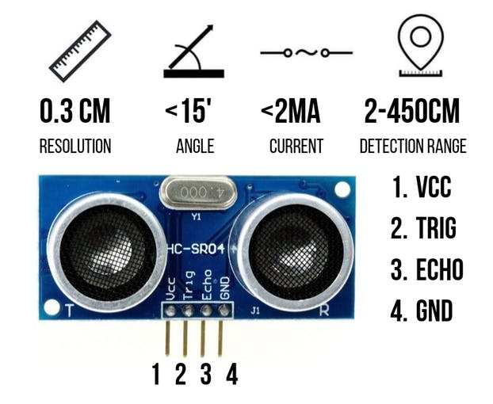
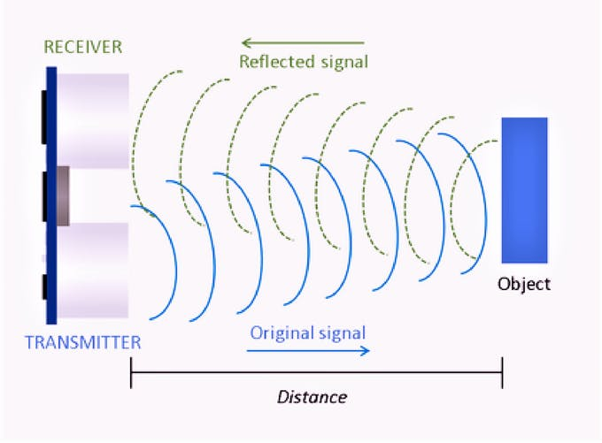
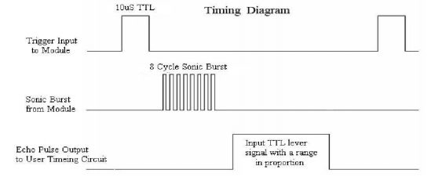
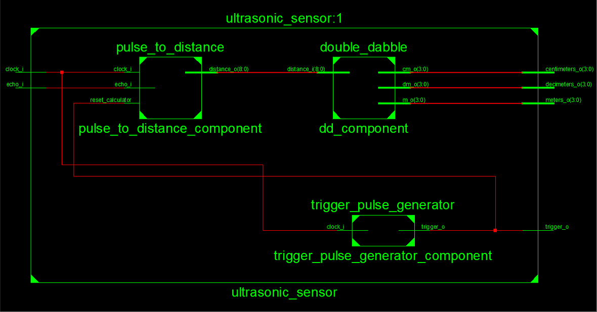

# Lab 9-13: Ultrazvukový měřič vzdálenosti HC-SR04. Výstup na 7segmentovém displeji.

#### Úvod

Našou úlohou bolo odmerať pomocou modulu HC-SR04 vzdialenosť a zobraziť ju na sedemsegmentovom displeji.

## Hardware description
&nbsp;
  
&nbsp;

Senzor HC-SR04 merá vzdialenosť pomocou vysielaných ultrazvukových vĺn o frekvencií 40k Hz.

Konfigurácia pinov:
- VCC: +5V
- TRIG - vysielač
- ECHO - prijímač
- GND - zem

&nbsp;&nbsp;
  
&nbsp;

Pomocou senzoru dokážeme merať vzdialenosť dobou, ktorá uplynie od vyslania pulzu, odrazenia sa od objeku po jeho príjem.

distance = (traveltime/2) * speed_of_sound

343 m/s = 0.0343 cm/us

cm = (durations/2) * 0.0343

## Popis funkcie

&nbsp;&nbsp;
  
&nbsp;

Podľa datasheetu potrebujeme na vstup Trigger vyslať krátky 10us pulz, na základe ktorého modul vyšle 8 ultrazvukových vĺn idúcich za sebou o frekvencií 40kHz na zvýčenie echa. Časový interval, v jednotkách us, medzi vyslaným a zachyteným pulzom nám stačí podeliť 58 aby sme získali vzdialenosť v centrimetroch.

Vytvorili sme si modul trigger_pulse_generator, pomocou ktorého generujeme každých 100ms 10us pulzy na vstup modulu TRIGGER. Ďalším modulom je counter, ktorý nám počíta čas medzi vyslaným signálom, ktorý sme poslali na vstup TRIGGER ultrazvukového modulu a signálom prijatým z výstupu modulu ECHO. Counter resetujem každým novým pulzom z modulu TRIGGER inak sa každou novou nástupnou hranou interného clocku inkrementuje. Danú širku pulzu predáme modulu pulse_to_distance, u ktorého proces začína po ukončení pulzu z výstupu ECHO-a modulu. Šírku pulzu (počet pulzou v jednotkách us) potrebujeme podeliť 58 aby sme dostali vzdialenosť v cm ale najprv ju musíme previesť z jednotiek ns na jednotky us.

Vnútorné hodiny Coolrunnera majú frekvenciu 8MHz čo sa rovná perióde o hodnote 125ns takže danú šírku pulzu potrebujeme podeliť 125 a vynásobiť 1000 aby sme dostali 1us. To sme docielili tým, že sme šírku pulzu vynásobili 19 a bitovo posunuli 13x do prava čím sme dostali 19/8192 čo je približne rovnako ako 1/58. Ak je daná hodnota vyššia než 450 cm tak sme prevíšili kapacity modulu v opačnom prípade posielame 9 bitovú hodnotu do BCD konvertora double_dabble, pomocou ktorého získame jednotky, desiatky a stovky.

## Diagram

&nbsp;&nbsp;
  
&nbsp;

## Odkazy

https://create.arduino.cc/projecthub/abdularbi17/ultrasonic-sensor-hc-sr04-with-arduino-tutorial-327ff6

https://cdn.sparkfun.com/datasheets/Sensors/Proximity/HCSR04.pdf

https://en.wikipedia.org/wiki/Double_dabble#Optimized_snippet_Bin2BCD_for_SBA_(VHDL)

https://www.pantechsolutions.net/fpga-projects/fpga-implementation-of-distance-measurement-with-ultrasonic-sensor

https://forums.intel.com/s/question/0D50P00003yyS6ESAU/ultrasonic-sensor-hcsr04-vhdl-code?language=en_US
